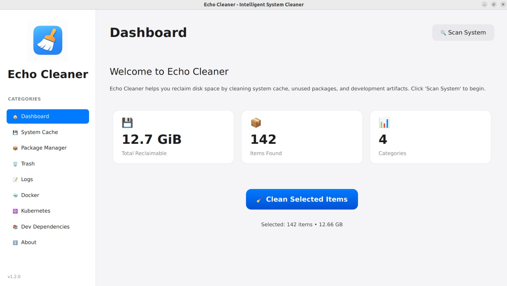
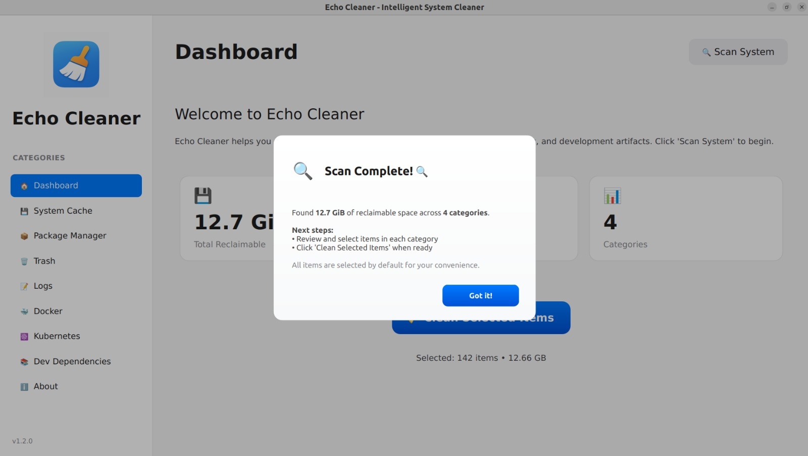
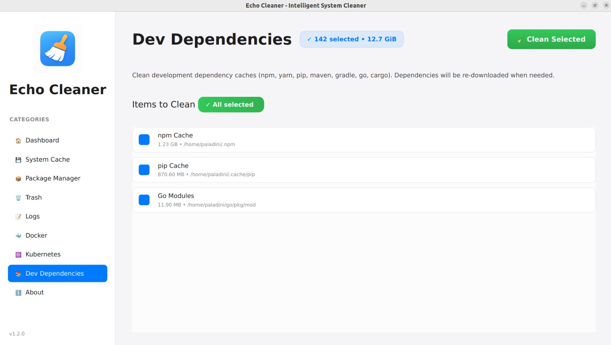
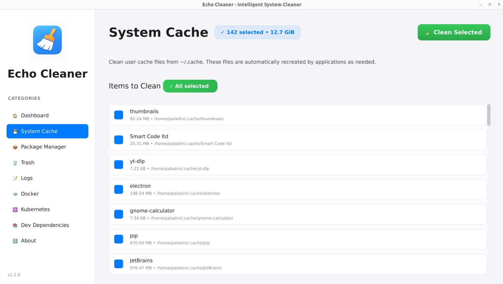
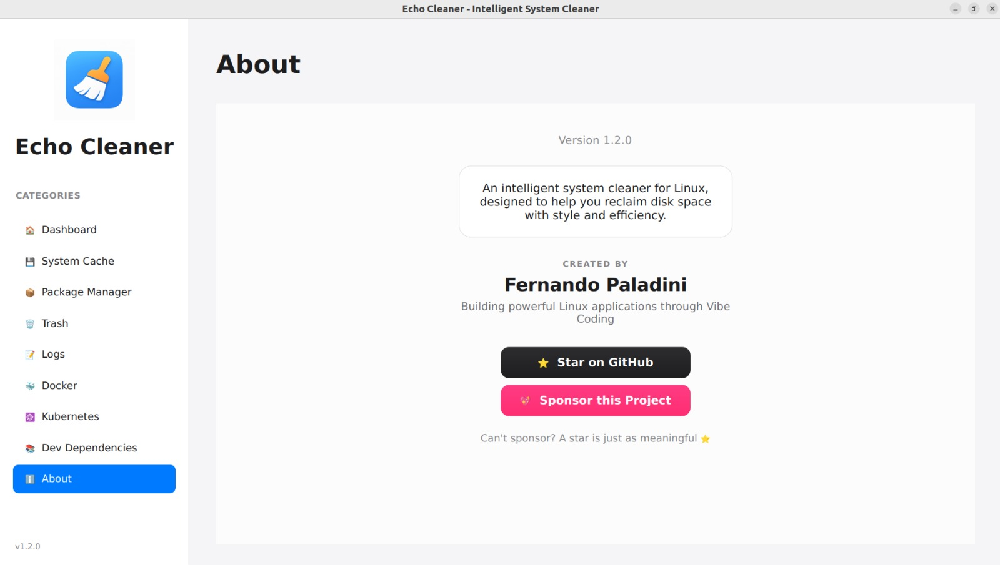

# Screenshots

## Main Dashboard

*The main dashboard showing scan results with statistics cards*

## Scan Complete

*Dashboard after completing a scan, showing reclaimable space*

## Category: Dev Dependencies

*Dev Dependencies cleaning section*

## Category: System 

*System Cache Category Page*

## About

*About page with version and details about this project*

## UI Features

- 🎨 **Clean Design**: Minimalist interface with no clutter
- 📊 **Visual Feedback**: Progress bars and status messages
- 💾 **Statistics Cards**: Easy-to-read metrics
- 🌈 **Modern Colors**: Subtle grays with blue accents
- ✨ **Smooth Animations**: Polished user experience
- 🔘 **Rounded Corners**: Modern, friendly appearance
